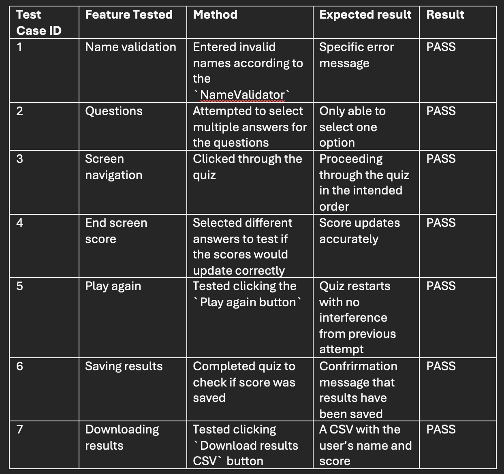
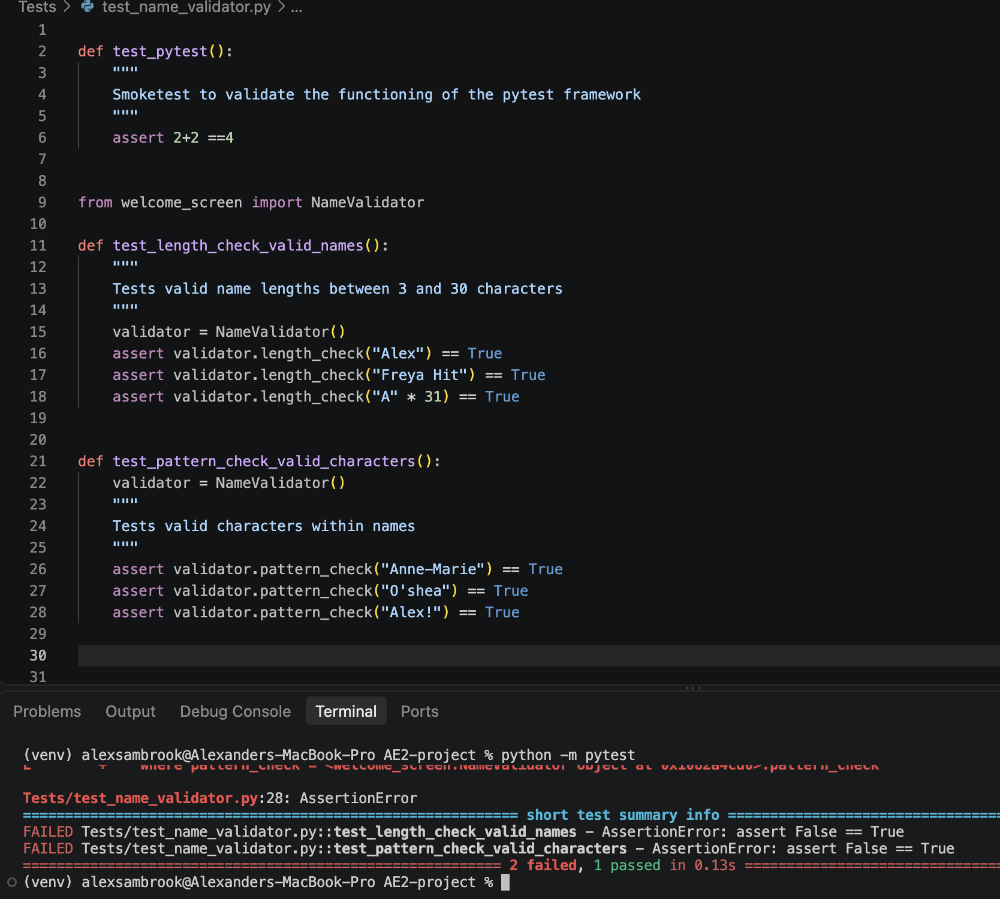
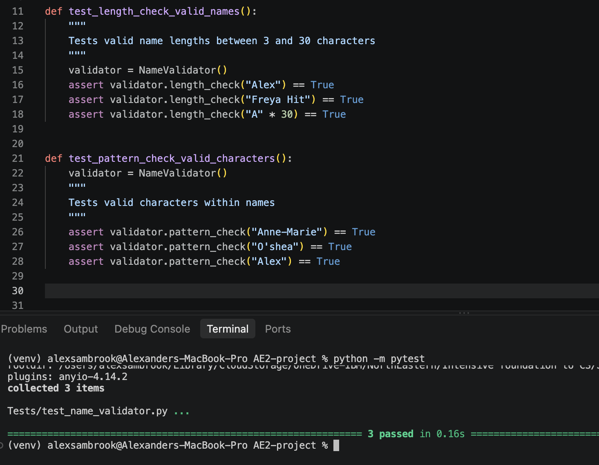
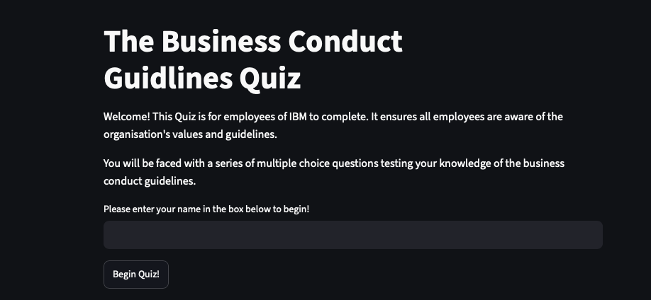

# IBM Business Conduct Guidlines Quiz

## Introduction 

This Business Conduct Guidelines (BCG’s) Quiz App is a minimum viable product (MVP) developed for IBM employees. IBM is an organisation specialising in technology and consulting. Therefore, the handling of sensitive data and work with rapidly developing artificial intelligence, presents an increasingly important initiative for employees to be aware of the organisation’s ethical values and principles.

The BCG’s Quiz App is a web application [Python](https://docs.python.org/3/) and [Streamlit](https://pypi.org/project/streamlit/). It collects an employee’s name and their answers to a series of single-answer multiple-choice questions around key themes in the official [Business Conduct Guidelines](https://www-api.ibm.com/adobe/assets/urn:aaid:aem:81857c4c-3c6f-43ec-b0a0-1b78d394b348/original/as/ibm_business_conduct_guidelines.pdf) of IBM. The purpose of the app is to provide an interactive method of learning the organisation’s values, it's intended to be sent out to all employees, ensuring they have sufficient knowledge of the guidelines.

The application will calculate and display the employee’s score. This lets the quiz support its learning focused purpose, allowing employees to see when they need to review the guidelines. 

To ensure data quality, the participant’s name is cleaned and validated before submission. If any rule is not met, the application will display an error message and prevent submission, ensuring that is transparent and accurate data stored, available for review at any time. A valid submission will ensure the participant’s name, and final score are written to a [CSV](https://docs.python.org/3/library/csv.html) file. This aligns with common workplace practices, as CSV files allow for simple portability and accessibility, and they can be processed using standard software, such as [MS Excel](https://www.microsoft.com/en-gb/microsoft-365/excel) or [Google Sheets](https://developers.google.com/workspace/sheets), without the need for additional systems.

Being an MVP, the application focuses on core functionality: input collection, validation, question delivery, and data storage. More advanced features are not implemented at this stage but provide clear opportunities for future enhancement.


## Design

### GUI Design 

The first stage of this project was to begin the design process. I began this using [Figma](https://www.figma.com) , a design tool that enabled me to create an initial wireframe, shown in **Figure 1**.  This wireframe displays the user journey throughout the quiz. The blue arrows represent the navigation flow from the welcome screen in frame 1 to the results screen in frame 5. It set out the intended structure and user interaction of my web application.


**Figure 1:** Wireframe


### Functional and Non-functional Requirements

#### Functional requirements

Next, I set out my Functional and Non-Functional of what I wanted this web application to provide. **Figure 2** sets out the Functional Requirements, these are general, core behaviours which describe what the application should do.

  
**Figure 2:** Functional Requirements

#### Non-Functional Requirements
**Figure 3** shows the Non-Functional Requirements, these are more precise and describe how well the application should perform.


 **Figure 3:** Non-functional Requirements

### Tech Stack Outline

The Tech Stack outline below provides the various tools, frameworks, and programming languages I have used throughout the project to build and run the web application.

[Python](https://docs.python.org/3/) - core programming language   
[Streamlit](https://pypi.org/project/streamlit/) - user interface framework for building quiz screens  
[CSV](https://docs.python.org/3/library/csv.html) - local data storage in CSV format  
[Figma](https://www.figma.com) - wireframing tool to design the GUI layout and user flow  
[Virtual Studio Code](https://code.visualstudio.com) - development environment for writing and testing code  
[GitHub](https://github.com) - repository hosting for the project  
[Pytest](https://docs.pytest.org/en/stable/) - Development testing framework  
[Draw.io](https://app.diagrams.net) - Diagramming tool to create the class diagram  

### Code Design

Next I created a code design document. **Figure 4** shows the class diagram I created using [Draw.io](https://app.diagrams.net), a tool useful for creating professional diagrams. The class diagram uses [UML](https://www.omg.org/uml/) to visually represent the structure of a system, including its classes and how they relate to each other, such as the dark filled arrow representing inheritance between parent and child classes in **Figure 4**.


**Figure 4:** Quiz application Class Diagram

## Development

I began the development of the project by creating a python virtual environment. This allowed me to isolate the project’s dependencies and run the web application with [Streamlit](https://pypi.org/project/streamlit/) without any interference with global python packages.

I began by setting up `main.py`, which acted as the central file for my project where I planned to import the rest of the [modules](https://docs.python.org/3/tutorial/modules.html). This allowed me to keep the code structured, with 6 modules making up different sections of the quiz. 

The first file I worked on was `welcome_screen.py`, this was where I had to create a title and add context to the quiz for the user. I also had the challenge of creating a `NameValidator` class, with the purpose of ensuring user names met specific requirements, otherwise met with an error message such as the one shown in **Figure 8**. My validation requirements had pattern checks, ensuring only permitted characters were used, for example no `?` were allowed. The length of the names were also checked, with the function below, which allows between 3 and 30 characters for a name.

```
def length_check(self, name: str) -> bool:
        """
        Checks if the name contains between 3 and 30 characters
        """
        return 3 <= len(name.strip()) <= 30
```
After this I conducted my first manual test, I completed these at the end each section before starting a new file. I go into this more specifically in the `Testing` section and **Figure 5**. 

Next, I moved onto the `questions.py`.  I created my questions using a parent class `Question` and two child classes: `MultipleChoiceQuestion` and `TrueFalseQuestion` which inherited the methods and attributes from the parent class. This allowed me to reuse the general code for questions into more specific code for the type of question which can be seen below for the `MultipleChoiceQuestion`.

```
class MultipleChoiceQuestion(Question):
    """
    A child class storing multiple choice questions with different options.
    """
    def __init__(self, text, options, correct_answer):
        """
        Inherits common attributes from the parent Question class.
        Adds a list of selectable options.
        """
        super().__init__(text, correct_answer)
        self.options = options
```
I imported the questions into my `quiz_screen.py` file where I created logic of scoring and loading questions, which eventually led to `end_screen.py` and `storage.py`. I built a `save_result` function in `Storage.py` which saved an individual’s score and name, and then a `load_results` function which allowed all previous results to be read, I then imported this into `end_screen.py`. This screen shows the user score, an option to download a CSV file of the results and a `Play again` button which reset all the session states to their original values. This allows the user to have a completely fresh retry of the quiz, the code for this section can be seen below.

```
if st.button("Play again"):
        st.session_state.question_number = 1
        st.session_state.score = 0
        st.session_state.question = None
        st.session_state.saved = False
        st.session_state.screen = "welcome"
        st.rerun()

```
I imported each module into `main.py`, this approach allowed this central file to be structured and readable, I then focused ensuring smooth navigation of the screens.
Finally, I completed the automated tests at the end which can be found in the `Testing`section, and then I uploaded my web application to the Streamlit community cloud.


## Testing

### Manual Testing

I did manual testing throughout each stage of my development process. This checked each section was fully complete and worked correctly with Streamlit before progressing the project. For example, I would not move onto the `questions.py` module before my manual tests for the `welcome_screen.py` file were successfully passing.

My manual tests can be seen in **Figure 5** below, this displays my method, the expected result and whether the tests eventually passed. These importantly allowed me to observe the web applications behaviour against the intended user navigation I created in the design section. There were often errors at first with each test, a key justification for why I decided to not develop any further stages of the quiz before my manual tests passed for the current stage.

Test Case ID 3, the Screen navigation test, was a slight anomaly. This is because it was repeated each time I added a new module of code to my quiz, ensuring that the GUI continued to display everything in the intended order.


  
**Figure 5:** Table of Manual tests


### Automated Unit testing

I then carried out automated unit testing as a final check before deploying my web application to the Streamlit community cloud. I decided to use the [Pytest](https://docs.pytest.org/en/stable/)
Framework as it allowed me to write isolated unit tests by creating a virtual environment and then running `pip install pytest`in the terminal. 

I began with a smoke test which can be seen at the top of **Figure 6**, this ensured the pytest framework was functioning correctly. I then went through some and tested some of the key functions and classes, such as the `NameValidator` class, these tests focused on checking the lengths and allowed character types for the user inputs. **Figure 6** shows that two tests failed, this is because of there being 31 characters in one input and an `!` in another input. This is then changed to 30 characters and removing the `!` in **Figure 7 which is why the tests all passed successfully.

The automated testing importantly allowed for quick checks at the end of my project, ensuring the key functions and classes were consistent, structured and correct. I also set up [Continuous Integration](https://www.atlassian.com/continuous-delivery/continuous-integration), which allowed automated unit tests to run automatically on any future code commits.



**Figure 6:** Pytest fail for invalid name

-------------------------------------------------------------------------------------------------------------------------------

  
**Figure 7:** Pytest pass for valid name  


## Documentation

### User Documentation

**Step 1:**
Click [This Link](https://app-quiz-app-w6bmfvcpflejdfuzzgca3a.streamlit.app) to launch the Streamlit web application in your browser.

**Step 2:**
Read the introduction for the quiz context, follow the instructions by writing your name in the indicated box. This name will have to meet certain requirements, an error messaged will explain if your inputted name does not meet these criteria, as shown in **Figure 8** below.

**Step 3:**
After pressing begin quiz you will be faced with the first question, these will be a mixture of multiple-choice and true or false questions. Select one answer to each question before selecting 'Next Question' to save your answer and continue the quiz.

**Step 4:**
See your score out of ten. You will not be able to see which questions you answered incorrectly as this is a test of your knowledge of the Business Conduct Guidelines and the questions do not change.

**Step 5:**
If you are not satisfied with your score you may select the 'Play again' button to restart the quiz. If you are satisfied, then please proceed to step 6.

**Step 6:**
You may download your results locally to [Excel](https://excel.cloud.microsoft/en-us/) by selecting the 'Download results CSV' button, and then the 'Download CSV' button which will display your name and score.


  
**Figure 8:** Name validation error message


### Technical Documentation

This technical documentation will outline how to deploy the web application locally and run some automated tests.

#### Installation

Use the code block below to copy and paste the command into your terminal to create a local copy of the project.

```
https://github.com/ASambrook/streamlit-quiz-app.git
```

Open [Virtual Studio Code](https://code.visualstudio.com) and select ‘File’ then ‘Open Folder’ and open the local copy of the quiz. You are now able to edit and run the application locally.

#### Virtual environment

A virtual environment should then be created, this allows the project to remain isolated from any other packages and projects.

Run the following commands in order:

```
python3 -m venv venv
```
```
source venv/bin/activate
```

#### Dependencies

The dependencies are the software which the web application requires to be installed in order to work, paste the below command in the terminal:

```
pip install streamlit pytest flake8
```
#### Run the application

Now that you have everything installed you should be able to deploy the quiz web application locally.

Run the below command in the terminal:

```
streamlit run main.py
```

#### Running automated unit tests

You can then check the code with automated unit tests using [Pytest](https://docs.pytest.org/en/stable/). 

Run the below command
```
pip install pytest
```
Then to execute the test the below command should be pasted. `python -m pytest` is used so any import errors are prevented.

```
python -m pytest
```


## Evaluation

On reflection, I'm pleased with how my [Python](https://docs.python.org/3/) developed web application closely matches to my initial wireframe design of the [GUI](https://www.britannica.com/technology/graphical-user-interface) and user navigation on [Figma](https://www.figma.com). I also found the choosing [Streamlit](https://pypi.org/project/streamlit/) as my method of hosting and deploying the app beneficial, I found the Streamlit documentation easy to follow and implement. It enabled me to quickly check my quiz and conduct manual tests throughout the development process.

However, I do think there are numerous improvements I could have implemented from the start of the project. On reflection I don’t believe I used automated unit testing as effectively as I could have, it would have been more effective to use [Pytest](https://docs.pytest.org/en/stable/) in a [Test-driven development](https://agilealliance.org/glossary/tdd/) style as I built each unit of code.
Similarly, I did not set up [Continuous Integration](https://www.atlassian.com/continuous-delivery/continuous-integration) until the end of my development process which would have ensured automated testing and high quality code for my early commits to [GitHub](https://github.com).

Overall, I believe this has been a successful project, as the developed quiz web application reflects my initial design and purpose of the quiz and a smooth user experience is provided.
