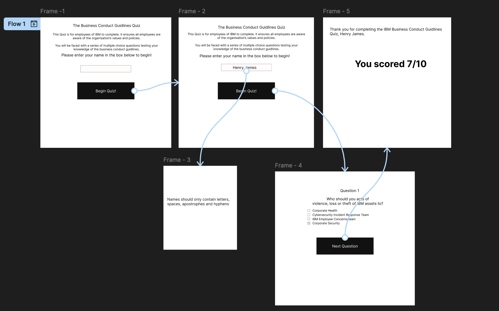
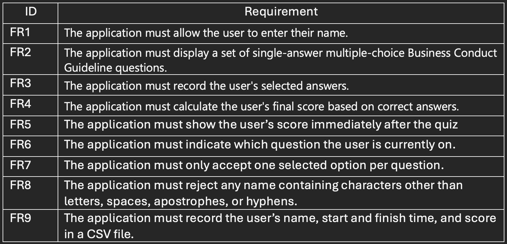
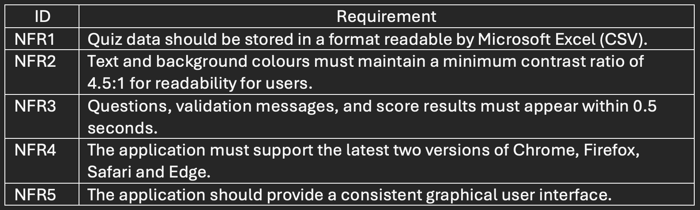
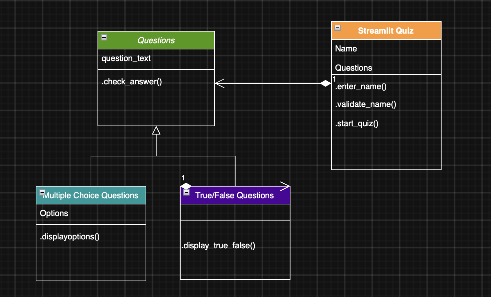

# IBM Business Conduct Guidlines Quiz

## Introduction 
This Business Conduct Guidelines (BCG’s) Quiz App is a minimum viable product (MVP) developed for IBM employees. IBM is an organisation that specialises in technology and consulting. Therefore, due to the handling of sensitive data and work with rapidly developing artificial intelligence, it is increasingly important for the employees to be aware of the organisation’s ethical values and principles.

The BCG’s Quiz App is a web application [Python](https://docs.python.org/3/) and [Streamlit](https://pypi.org/project/streamlit/). It collects an employee’s name and their answers to a series of single-answer multiple-choice questions around key themes in the official [Business Conduct Guidelines](https://www-api.ibm.com/adobe/assets/urn:aaid:aem:81857c4c-3c6f-43ec-b0a0-1b78d394b348/original/as/ibm_business_conduct_guidelines.pdf) of IBM. The purpose of the app is to provide a more interactive method of learning the organisation’s values, it is intended to be sent out to all employees, ensuring they have sufficient knowledge of the guidelines, and supporting the theme of integrity for IBM.

The application will calculate the employee’s score and immediately display their score. This lets the quiz support its learning focused purpose, allowing employees to see when they need to review the guidelines or when they have a sufficient level of knowledge. 

To ensure data quality, the participant’s name is cleaned and validated before submission. If any rule is not met, the application will display an error message and prevent submission, ensuring that is transparent and accurate data stored, available for review at any time. A valid submission will ensure the participant’s name, selected answers, and a timestamp are written to a [CSV](https://docs.python.org/3/library/csv.html) file. This aligns with common workplace practices, as CSV files allow for simple portability and accessibility, and they can be processed using standard software, such as [MS Excel](https://www.microsoft.com/en-gb/microsoft-365/excel) or [Google Sheets](https://developers.google.com/workspace/sheets), without the need for additional systems.

Being an MVP, the application focuses on core functionality: input collection, validation, question delivery, and data storage. More advanced features are not implemented at this stage but provide clear opportunities for future enhancement.

## Design

### GUI Design 

**Figure 1:** Wireframe

### Functional and Non-functional Requirements

#### Functional requirements

 
**Figure 2:** Functional Requirements

#### Non-Functional Requirements

 **Figure 3:** Non-functional Requirements

### Tech Stack Outline
[Python](https://docs.python.org/3/) - core programming language   
[Streamlit](https://pypi.org/project/streamlit/) - user interface framework for building the quiz screens  
[CSV](https://docs.python.org/3/library/csv.html) - local data storage in CSV format  
[Figma](https://www.figma.com) - wireframing tool used to design the GUI layout and user flow  
[Virtual Studio Code](https://code.visualstudio.com) - primary development environment for writing and testing code  
[GitHub](https://github.com) - repository hosting for the project  
[Pytest](https://docs.pytest.org/en/stable/) - Development testing framework  
[Draw.io](https://app.diagrams.net) - Diagraming tool used to create the class diagram  

### Code Design

**Figure 4** Quiz application Class Diagram